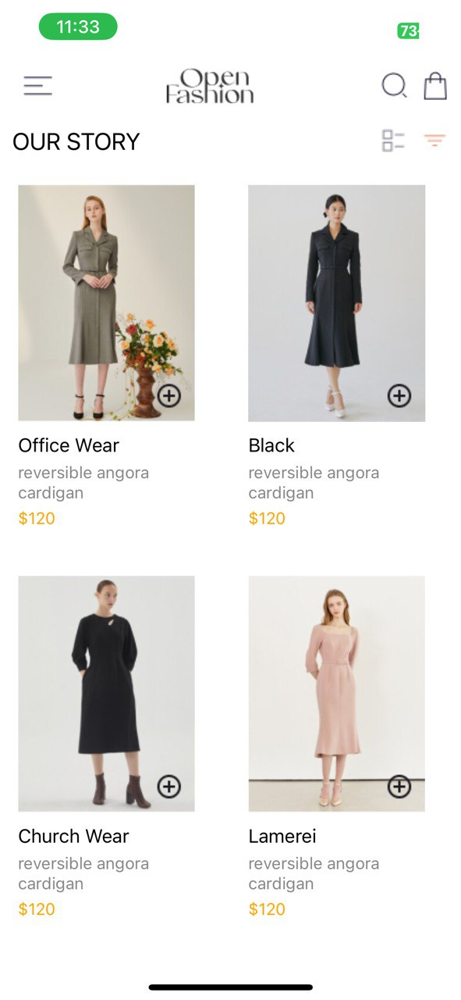
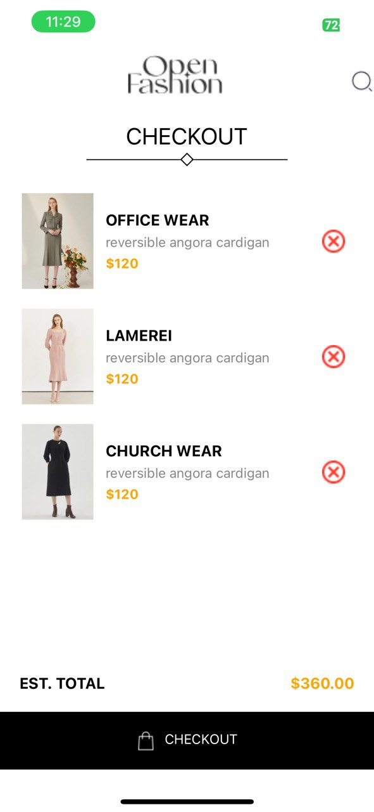

# rn-assignment6-11327734

 The app features a HomeScreen to display products, a CartScreen to manage the user's cart, and a CheckoutScreen to finalize the purchase.

# Design Choices

Navigation: The app uses react-navigation to navigate between screens, providing a user-friendly experience.
Data Storage: AsyncStorage is used to store the user's cart data locally on the device. This allows the cart to persist even after the app is closed.
UI Components: The UI is built using standard react-native components like View, Text, TouchableOpacity, and FlatList.
Styling: The app uses StyleSheet to define styles for UI elements, ensuring consistency across the app.
Images: The app utilizes image assets from the provided documents, enhancing the visual appeal.

# Implementation Details
# HomeScreen:
Displays a list of products using FlatList.
Each product item includes an image, name, price, and "Add to Cart" button.
Clicking the "Add to Cart" button updates the cart data in AsyncStorage.

# CartScreen:
Displays the user's cart items using FlatList.
Each cart item includes an image, name, price, and "Remove" button.
Clicking the "Remove" button updates the cart data in AsyncStorage.
Calculates and displays the total price of the cart items.
Provides a "Checkout" button to navigate to the CheckoutScreen.

# CheckoutScreen:
Displays the cart items and their total price.
Includes a "Checkout" button that, when clicked, will trigger the checkout process.
Currently, the checkout logic is a placeholder, but it should be replaced with actual payment integration.

# Header.js:
Provides a reusable header component for the app.
Includes a logo, search icon, and cart icon.
The cart icon navigates to the CartScreen.

# App.js:
Sets up the navigation stack using react-navigation.
Defines the initial route as "Home" and includes the HomeScreen, CartScreen, and CheckoutScreen in the stack.!